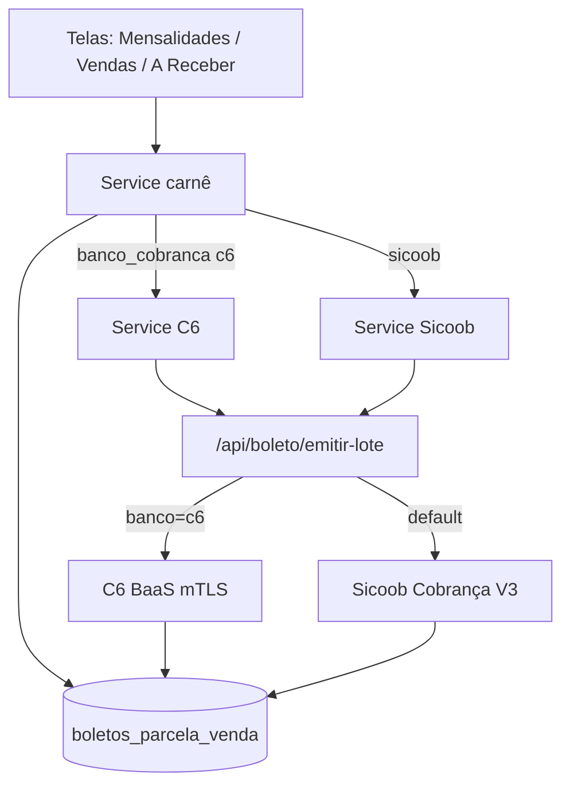

# Emissão de Boleto — referência do SistemaJessica (Azoup Financeiro)

Documento de referência para reutilizar a ideia em outro sistema. Descreve o modelo mental, o fluxo e as decisões de arquitetura — não é um dump linha a linha do código.

---

## 1. Ideia geral

1. Toda cobrança (mensalidade ou parcela de venda) gera um **carnê** na tabela `boletos_parcela_venda` (snapshot de cobrador + pagador + valor + vencimento).
2. Esse carnê pode ficar só **informativo** (HTML interno) ou ser **registrado no banco** (Sicoob ou C6), gerando linha digitável, código de barras e PDF oficial.
3. O banco é escolhido pelo **emitente (CNPJ)** da cobrança, não por um switch global fixo no app.

```
Mensalidade / Venda
        │
        ▼
boletos_parcela_venda  (carnê sempre criado)
        │
        ├── tipo_emissao = informativo  → PDF/HTML interno
        ├── tipo_emissao = sicoob       → API Sicoob Cobrança V3
        └── tipo_emissao = c6           → API C6 BaaS (mTLS)
```

---

## 2. Bancos e roteamento

| Banco | Quando usar | Auth |
|-------|-------------|------|
| **C6 Bank** | Emitente com `banco_cobranca = 'c6'` (no sistema: CNPJ cobrador `05.320.214/0001-69`) | OAuth `client_credentials` + **mTLS** (`.crt` + `.key`) |
| **Sicoob** | Demais emitentes / padrão; **vendas** hoje só Sicoob | OAuth + certificado **A1** (`.pfx`) |

### Regra prática de roteamento

- Cadastro do emitente NFS-e tem o campo `banco_cobranca`: `'sicoob' | 'c6'`.
- CNPJ cobrador C6: `05320214000169` → força C6.
- Sem seleção: tenta emitente C6; senão o emitente padrão (Sicoob).
- **Venda**: hoje sempre tenta Sicoob (não há branch C6 na criação da venda).

Constante útil:

```text
C6_CNPJ_COBRADOR = '05320214000169'
```

---

## 3. Modelo de dados (conceitual)

Tabela central: **`boletos_parcela_venda`**.

### Vínculos

| Campo | Significado |
|-------|-------------|
| `origem` | `'mensalidade'` ou `'venda'` |
| `mensalidade_id` | 1:1 com mensalidade (quando origem mensalidade) |
| `venda_id` + `parcela_id` | parcela da venda (quando origem venda) |
| `emitente_id` | CNPJ/emitente que define o banco |
| `nota_fiscal_id` | NFS-e vinculada (opcional) |

### Snapshot (não depender do cadastro mudar depois)

- Beneficiário: razão social, documento, endereço.
- Pagador: nome, documento, endereço.
- `valor_documento`, `data_vencimento`, `data_documento`.
- `nosso_numero`, `numero_documento`, `instrucoes`, `local_pagamento`.

### Registro bancário

| Campo | Uso |
|-------|-----|
| `tipo_emissao` | `informativo` \| `sicoob` \| `c6` |
| `status_registro` | ver enum abaixo |
| `linha_digitavel` | linha digitável |
| `codigo_barras` | código de barras |
| `nosso_numero_banco` | nosso número retornado pelo banco |
| `pdf_storage_path` / `pdf_url` | PDF no Storage (URL assinada) |
| `mensagem_erro_registro` | último erro legível |
| `data_registro` | quando registrou |

### Específico C6

- `c6_boleto_id`, `c6_external_id`
- Pix (opcional): `pix_txid`, `pix_copia_cola`, `pix_location`, `pix_status`

### Enums

```text
tipo_emissao:    informativo | sicoob | c6
status_registro: informativo | pendente | registrado | erro | baixado | pago
```

### Convenção de número do documento

- Mensalidade: `MEN-{id8}-{competencia}`
- Venda: `VD-{id8}-{n}/{total}`

### Configuração

- `config_c6` — client id/secret, ambiente, billing scheme, paths dos certs mTLS.
- `config_sicoob` — client id, número cliente, ativo, etc.
- `perfil_cobranca` — dados do beneficiário usados no carnê.
- Buckets Storage: `boletos_c6`, `boletos_sicoob`, `c6_certs`.

---

## 4. Fluxo em etapas

### 4.1 Gerar carnê (sempre)

1. Usuário gera mensalidade **ou** cria venda com parcelas.
2. Sistema monta o snapshot (cobrador do emitente/perfil + pagador do cliente).
3. Insere linha em `boletos_parcela_venda` (ainda pode ser informativo).
4. Em seguida tenta registrar no banco conforme o emitente.

**Importante:** se o registro no banco falhar, **não apagar** a mensalidade/carnê. Deixar com `status_registro = erro` (ou informativo) e permitir “Registrar de novo” depois.

### 4.2 Registrar no C6 (mensalidade)

```
UI (emitente C6)
  → cria carnê
  → POST /api/boleto/emitir-lote
       { banco: 'c6', emitenteId, boletoIds: [id], modoRapido: true }
  → mTLS auth → POST /v1/bank_slips
  → grava c6_boleto_id + linha digitável (PDF muitas vezes ainda não)
  → depois: "Registrar no C6" com modoRapido: false
       → busca PDF + tenta Pix cobv
```

#### Modo rápido vs completo (lição de serverless)

| | Modo rápido (`modoRapido: true`) | Modo completo |
|--|----------------------------------|---------------|
| POST bank_slips | sim | sim |
| Enriquecer linha digitável | leve | consulta extra |
| Baixar PDF | **não** | sim (com retries) |
| Pix cobv | **não** | best-effort |
| Motivo | caber no timeout (~60s Vercel) | documento completo |

Boas práticas C6 neste sistema:

- **1 boleto por request** no lote (evita 504).
- Valor mínimo **R$ 5,00** e máximo **R$ 500.000,00** (validar antes da API).
- Sandbox **não entra na CIP** (boleto “de verdade” só em produção).
- PDF pode demorar na CIP: aceitar linha digitável sem PDF e completar depois.

#### Credenciais C6 (resumo)

- Ambiente: sandbox (`baas-api-sandbox.c6bank.info`) ou produção (`baas-api.c6bank.info`).
- Auth: `POST /v1/auth` com client credentials + mTLS.
- Boleto: `POST /v1/bank_slips`.
- PDF: `GET /v1/bank_slips/{id}/pdf`.
- `billing_scheme`: sandbox costuma `21`; produção `15` (configurável).

### 4.3 Registrar no Sicoob

```
UI / venda criada
  → cria carnê(s)
  → se config_sicoob.ativo:
       POST /api/boleto/emitir-lote { boletoIds }
  → certificado A1 (.pfx) + OAuth
  → API Cobrança V3 (incluir boleto, gerarPdf: true)
  → sobe PDF no Storage → status_registro = registrado
  → se config inativa: mantém carnê informativo
```

### 4.4 Abrir / compartilhar documento

1. Se `registrado|pago|baixado` e existe `pdf_url` / path → abre PDF do banco (URL assinada).
2. Senão → HTML do carnê interno.
3. **Exceção C6:** sem registro real, **não** fingir boleto bancário pagável; pedir “Registrar no C6”.
4. Compartilhar: WhatsApp (mensagem + linha/Pix) ou e-mail (anexo PDF / rascunho `.eml`).

### 4.5 Baixa / liquidação

- Job/API de sincronização consulta boletos `registrado` e marca `pago`/`baixado`.
- Webhook do banco (Sicoob e C6 no mesmo endpoint, com heurística/`?banco=c6`).
- Ao liquidar: atualiza mensalidade ou parcela/venda e o próprio boleto.

### 4.6 NFS-e (opcional)

- Após autorizar NFS-e, vincula `nota_fiscal_id` no boleto.
- Instruções do boleto Sicoob podem citar o número da NFS-e.

---

## 5. API (contrato mental)

Endpoint unificado de emissão:

```http
POST /api/boleto/emitir-lote
Authorization: Bearer <jwt>
Content-Type: application/json

{
  "boletoIds": ["uuid"],
  "banco": "c6",          // omitir = Sicoob
  "emitenteId": "uuid",   // obrigatório no C6
  "modoRapido": true      // só C6
}
```

Outros endpoints úteis:

| Rota | Função |
|------|--------|
| `POST /api/boleto/sincronizar` | consulta e baixa automáticos |
| `POST /api/boleto/consultar-pendentes` | ajuda a enriquecer pendentes |
| `POST /api/boleto/webhook-sicoob` | webhook Sicoob/C6 |

Timeout serverless típico: **60 segundos** → desenhar lote fino + modo rápido.

---

## 6. Camadas sugeridas (para outro sistema)

Espelhe esta separação:

1. **Domain / types** — enums, row do boleto, input de emissão.
2. **Service de carnê** — cria snapshot a partir de mensalidade/venda (sempre).
3. **Service por banco** — C6 e Sicoob isolados (creds, payload, parse de retorno).
4. **API serverless** — auth do usuário, carrega boleto, chama client do banco, persiste.
5. **UI** — gerar → registrar → abrir PDF → reemitir / registrar de novo.
6. **Storage** — PDF oficial separado do HTML interno.



---

## 7. Telas / pontos de entrada (neste app)

| Onde | O que faz |
|------|-----------|
| Gerar mensalidade | escolhe emitente (C6/Sicoob) → cria mensalidade + carnê + tenta registro |
| Histórico de mensalidades | baixar boleto; **Registrar no C6** se faltou PDF/linha |
| Contas a receber | ações: PDF, Registrar C6, WhatsApp, e-mail, NFS-e, marcar pago |
| Nova venda | gera carnê por parcela; tenta Sicoob |
| Configurações C6 / Sicoob | credenciais, ambiente, certificados |

---

## 8. Erros que o desenho precisa prever

| Problema | Como este sistema trata |
|----------|-------------------------|
| Timeout 504 no lote | 1 boleto/request + modo rápido C6 |
| Valor &lt; R$ 5 no C6 | validação local antes da API |
| CIP / PDF atrasado | salva linha; PDF depois no “Registrar no C6” |
| Sandbox C6 | boleto não liquidável na CIP; usar produção para teste real |
| Certificado ausente | erro claro pedindo upload mTLS (C6) ou A1 (Sicoob) |
| Falha no banco na geração | **mantém** carnê; UI oferece “tentar de novo” |
| Pix cobv falhou | boleto ainda é válido; Pix é best-effort |

---

## 9. Checklist para portar a outro projeto

- [ ] Tabela única de carnê com snapshot + status de registro.
- [ ] Criar carnê **sempre**, registrar no banco em passo separado (ou best-effort).
- [ ] Roteamento por emitente/CNPJ (ou por conta bancária cadastrada).
- [ ] Dois adapters: Sicoob (A1) e C6 (mTLS).
- [ ] Limites de valor e mensagens de erro legíveis (`detail` da API).
- [ ] Modo “rápido” vs “completo” se a API tiver timeout curto.
- [ ] Storage de PDF + URL assinada.
- [ ] Tela de reemissão / “registrar de novo”.
- [ ] Sincronização de baixa (polling e/ou webhook).
- [ ] Não vender carnê HTML como boleto C6 não registrado.

---

## 10. Arquivos-chave neste repositório

```text
services/boletoParcelaService.ts      # cria carnês, lista a receber
services/c6BoletoService.ts           # lote C6 (cliente)
services/sicoobBoletoService.ts       # lote Sicoob (cliente)
services/c6ConfigService.ts           # config + pickEmitenteC6
services/c6SandboxDefaults.ts         # CNPJ cobrador, defaults ambiente

api/boleto/emitir-lote.js
api/boleto/_lib/emitirBoletoC6.js
api/boleto/_lib/c6Client.js
api/boleto/_lib/c6Credentials.js
api/boleto/_lib/emitirBoleto.js       # Sicoob
api/boleto/_lib/baixarBoletoPago.js

utils/openBoletoDocumento.ts
utils/boletoCobrancaHtml.ts
utils/compartilharBoletoEmail.ts

app/(app)/mensalidades/gerar.tsx
app/(app)/mensalidades/index.tsx
app/(app)/contas-receber/index.tsx
app/(app)/configuracoes/c6.tsx
app/(app)/configuracoes/sicoob.tsx

supabase/migrations/017_contas_receber_boletos.sql
supabase/migrations/026_sicoob_boleto.sql
supabase/migrations/045_c6_boleto.sql
supabase/migrations/047_c6_cnpj_cobrador.sql
```

---

## 11. Resumo em uma frase

**Sempre persista o carnê; registre no banco certo conforme o CNPJ emitente; no C6 separe “registrar rápido” de “buscar PDF/Pix” para não estourar timeout; e nunca apresente HTML interno como boleto bancário pagável quando o registro real falhou.**
