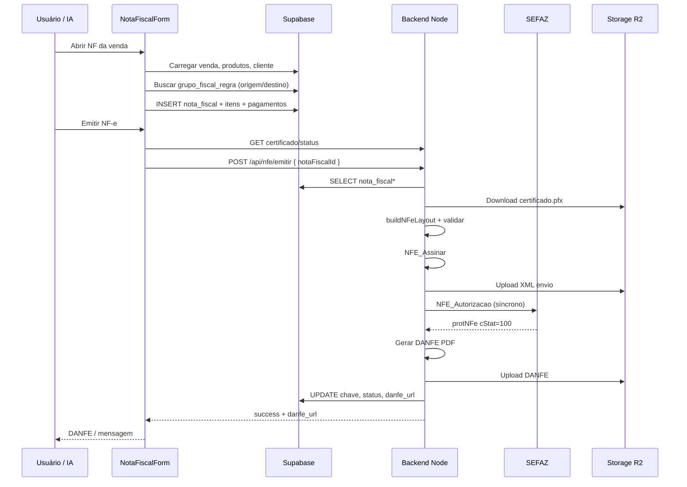

# Modelo de geração de Nota Fiscal (NF-e) — Azoup

Documento de referência para entender **como o sistema Azoup gera, persiste e emite NF-e**, com foco em replicar o mesmo padrão em outro projeto (inclusive com IA conversacional).

> **Escopo:** NF-e de **saída** (modelo 55), integração direta com **SEFAZ** via certificado A1.  
> **Fora do escopo deste doc:** NF-e de entrada, NFC-e, NFS-e municipal.

---

## 1. Visão geral da arquitetura

O sistema separa claramente **três fases**:

| Fase | Onde roda | Responsabilidade |
|------|-----------|------------------|
| **1. Montagem fiscal** | Frontend (React Native Web) | Coletar dados da venda, aplicar regras fiscais, salvar rascunho no banco |
| **2. Emissão SEFAZ** | Backend Node.js | Montar XML, assinar, autorizar, gerar DANFE, persistir retorno |
| **3. Pós-emissão** | Backend + Frontend | Cancelamento, carta de correção, inutilização, manifesto, consulta |

```
┌─────────────┐     salva rascunho      ┌──────────────────┐
│  Frontend   │ ───────────────────────►│  Supabase (PG)   │
│ NotaFiscal  │                         │  nota_fiscal*    │
│    Form     │                         └────────┬─────────┘
└──────┬──────┘                                  │
       │ POST { notaFiscalId }                   │ lê dados
       ▼                                         ▼
┌─────────────┐   nfewizard-io    ┌──────────────────────────┐
│  Backend    │ ────────────────► │  SEFAZ (webservice NF-e) │
│ index.js    │ ◄──────────────── │  autorização síncrona    │
└──────┬──────┘                   └──────────────────────────┘
       │
       ├──► R2/Storage: XML envio, XML nfeProc, DANFE PDF
       └──► Atualiza nota_fiscal (chave, protocolo, status_sefaz)
```

### Bibliotecas críticas (backend)

| Pacote | Função |
|--------|--------|
| `nfewizard-io` | Ambiente SEFAZ, assinatura XML, autorização, cancelamento, inutilização, manifesto |
| `@nfewizard/danfe` | Geração do PDF DANFE a partir do `nfeProc` |
| `@nfewizard/shared` | Parser XML auxiliar |

Arquivo principal: `backend/index.js`  
Componente principal: `frontend/src/components/NotaFiscalForm.js`

---

## 2. Fluxos de negócio

### 2.1 Fluxo manual (usuário na tela NF-e)

1. Usuário abre **Nota Fiscal** a partir de uma **venda** (ou modo manual sem venda).
2. O formulário carrega:
   - Cabeçalho da venda (empresa, cliente, frete, desconto)
   - Itens da venda (`venda_itens` → produtos com NCM, SKU, grupo fiscal)
   - Formas de pagamento da venda
3. Usuário seleciona **tipo de operação** (ex.: venda interestadual).
4. Clica **Aplicar regras fiscais** → sistema busca `grupo_fiscal_regra` por UF origem/destino e preenche CFOP, CST/CSOSN, alíquotas nos itens.
5. Clica **Salvar** → grava `nota_fiscal`, `nota_fiscal_item`, `nota_fiscal_transporte`, `nota_fiscal_pagamento`, `nota_fiscal_parcela`.
6. Clica **Emitir NF-e** → frontend valida certificado e chama `POST /api/nfe/emitir`.
7. Backend monta XML, envia à SEFAZ, gera DANFE, atualiza status.

### 2.2 Fluxo automático (Faturamento → NF-e)

Usado no Kanban de vendas quando o usuário escolhe **Gerar NF-e** no faturamento:

1. `FaturamentoScreen` cria/atualiza `venda_faturamento` + itens parciais + contas a receber.
2. Renderiza `NotaFiscalForm` com `autoEmitir={true}`.
3. O formulário, após carregar e aplicar regras fiscais automaticamente:
   - `handleSalvar()` → persiste a nota
   - `handleEmitirNFe(nfId)` → chama o backend
4. Se SEFAZ **rejeitar** (`status_sefaz !== '100'`), o faturamento financeiro é revertido (rollback).

Arquivos: `frontend/src/components/FaturamentoScreen.js`, trecho `autoEmitir` em `NotaFiscalForm.js`.

### 2.3 Fluxo resumido para IA (recomendado em outro projeto)

Para um assistente de IA emitir NF-e com segurança, **não chame a SEFAZ diretamente**. Replique este contrato:

```
IA → valida pré-requisitos (empresa, certificado, cliente, itens)
IA → cria/atualiza rascunho nota_fiscal (via API ou Supabase)
IA → confirma com usuário (resumo: valor, cliente, itens)
IA → POST /api/nfe/emitir { notaFiscalId }
IA → interpreta retorno (status 100 = sucesso; outros = erro com xMotivo)
IA → entrega link DANFE (danfe_url) ou mensagem amigável
```

A IA deve **orquestrar** o fluxo existente, não reimplementar XML/SEFAZ.

---

## 3. Modelo de dados (Supabase)

### 3.1 Tabelas centrais

#### `nota_fiscal` — cabeçalho do documento

Campos principais (ver `frontend/database/nota_fiscal_schema.sql` + migrations):

| Campo | Descrição |
|-------|-----------|
| `venda_id` | Venda origem (nullable em modo manual) |
| `venda_faturamento_id` | Faturamento que originou a nota |
| `empresa_id` | Emitente |
| `cliente_id` | Destinatário |
| `tipo_operacao_id` | Tipo de operação fiscal |
| `serie`, `numero` | Numeração (número sugerido = MAX+1 por empresa) |
| `data_emissao`, `data_saida_entrada` | Datas do documento |
| `finalidade`, `presenca_consumidor`, `consumidor_final` | Flags NF-e |
| `indicador_destino` | 1=interna, 2=interestadual, 3=exterior |
| `desconto_valor`, `frete`, `valor_total` | Totais |
| `observacao` | Texto livre |
| **Pós-emissão** | |
| `chave_acesso` | 44 dígitos |
| `protocolo_autorizacao` | Protocolo SEFAZ |
| `status_sefaz` | `100` = autorizada; `101`/`135`/`155` = cancelada |
| `xml_autorizado` | XML `nfeProc` completo |
| `danfe_url` | URL pública do PDF |
| `data_autorizacao` | Timestamp |

#### `nota_fiscal_item` — snapshot fiscal por linha

Cópia desnormalizada dos dados fiscais no momento da emissão (ver `nota_fiscal_item_schema.sql`):

- Produto: `descricao`, `ncm`, `cest`, `unidade`, `quantidade`, `valor_unitario`, `valor_total`
- Regra aplicada: `grupo_fiscal_regra_id`, `origem`, `destino`, `cfop`
- Tributos: `cst`, `csosn_*`, `perc_icms`, `cst_pis`, `cst_cofins`, etc.

> **Importante:** o backend lê **exclusivamente** `nota_fiscal_item` para montar o XML. O que estiver salvo aqui é o que vai para a SEFAZ.

#### `nota_fiscal_transporte`, `nota_fiscal_pagamento`, `nota_fiscal_parcela`

Dados de frete/transportadora e formas de pagamento (copiados da venda ou editados no formulário).

#### `empresa_certificado` — certificado A1

| Campo | Descrição |
|-------|-----------|
| `empresa_id` | Empresa dona |
| `storage_path` | Caminho do `.pfx` no bucket `empresa_certificados` |
| `senha_criptografada` | Senha AES no backend (`CERT_ENCRYPTION_KEY`) |
| `ativo` | Apenas um certificado ativo por empresa |

#### Motor fiscal — `grupo_fiscal_regra`

Regras por **grupo fiscal do produto × empresa × tipo operação × UF origem × UF destino**:

```
produtos.grupo_fiscal_id
    → grupos_fiscais
    → grupo_fiscal_regra (cfop, cst, csosn, alíquotas...)
```

Schema: `frontend/database/grupo_fiscal_regra_schema.sql`  
Tela de configuração: `frontend/src/components/GrupoFiscalScreen.js`

#### Faturamento — `venda_faturamento`

Permite NF parcial por pedido. Status: `FINANCEIRO_GERADO` → `NFE_AUTORIZADA`.

### 3.2 Cadastros que alimentam a NF-e

| Entidade | Campos fiscais relevantes |
|----------|---------------------------|
| `empresas` | CNPJ, IE, razão social, endereço, `regime_id` (CRT), `nfe_ambiente` |
| `clientes_cadastros` | CPF/CNPJ, nome, IE, consumidor final |
| `cliente_endereco` | Endereço + `cidade_id` → `cidades.codigo_ibge` |
| `produtos` | NCM, SKU, unidade, `grupo_fiscal_id` |
| `venda` / `venda_itens` | Quantidades, valores, frete, desconto |
| `tipo_operacao` | Descrição (vira `natOp` no XML) |

Referência de mapeamento campo a campo: `frontend/database/ANALISE_CAMPOS_NFE.md`

---

## 4. Frontend — montagem da nota

### 4.1 Componente `NotaFiscalForm.js`

Responsabilidades:

1. **Carregar contexto** — venda, empresa, cliente, itens, pagamentos
2. **Calcular UF origem/destino** — define qual regra fiscal aplicar
3. **Aplicar regras fiscais** — query em `grupo_fiscal_regra` e merge nos itens
4. **Salvar rascunho** — INSERT/UPDATE nas tabelas `nota_fiscal*`
5. **Emitir** — `POST /api/nfe/emitir`

Pré-validações antes de emitir:

- Certificado ativo: `GET /api/nfe/empresa/:id/certificado/status`
- Nota não autorizada/cancelada
- Tipo de operação preenchido
- Itens com NCM, quantidade, valor

Numeração automática:

```javascript
// MAX(numero) por empresa + 1
const { data: maxNf } = await supabase
  .from('nota_fiscal')
  .select('numero')
  .eq('empresa_id', empresaId)
  .order('numero', { ascending: false })
  .limit(1)
  .maybeSingle();
const proxNum = maxNf?.numero ? String(Number(maxNf.numero) + 1) : '1';
```

### 4.2 Aplicação de regras fiscais (lógica-chave)

Pseudo-fluxo (replicar em IA ou outro backend):

```
PARA cada item da nota:
  grupoId = produto.grupo_fiscal_id
  origemUF = empresa.estado
  destinoUF = cliente.endereco.estado
  tipoOp = nota.tipo_operacao_id

  regra = SELECT * FROM grupo_fiscal_regra
          WHERE grupo_fiscal_id = grupoId
            AND empresa_id = empresaId
            AND tipo_operacao_id = tipoOp
            AND origem = origemUF
            AND destino = destinoUF

  SE regra encontrada:
    item.cfop = regra.cfop
    item.cst / item.csosn = conforme regime
    item.perc_icms = regra.perc_icms
    ... demais campos tributários
```

### 4.3 Modos de operação

| Modo | Quando | Particularidade |
|------|--------|-----------------|
| Venda vinculada | NF a partir de pedido | Herda itens e pagamentos da venda |
| Manual (`modoManual`) | NF avulsa | Usuário escolhe empresa, cliente e itens |
| `autoEmitir` | Faturamento | Salva + emite sem interação; rollback se falhar |
| Faturamento parcial | `ratioOverride` / overrides de quantidade | Emite só parte dos itens do pedido |

---

## 5. Backend — emissão SEFAZ

### 5.1 Endpoint principal

```
POST /api/nfe/emitir
Body: { "notaFiscalId": "<uuid>" }
```

Sequência interna (`backend/index.js`):

1. Buscar `nota_fiscal` (com retry 3× por race condition)
2. Validar `empresa_certificado` ativo
3. Buscar itens, transporte, pagamentos, empresa, cliente
4. Baixar `.pfx` do storage → arquivo temporário
5. `NFE_LoadEnvironment` — validar certificado + CNPJ
6. `validarDadosNFe()` — CNPJ emitente, IE, endereços, NCM 8 dígitos, etc.
7. `buildNFeLayout()` — montar objeto Layout NF-e 4.00
8. `sanitizeLayoutNFeDecimals()` — formatar decimais XSD (TDec_1302, TDec_1204)
9. `NFE_Assinar` — XML assinado → bucket `nfe_xmls`
10. `NFE_Autorizacao` — envio síncrono (`indSinc: 1`)
11. Interpretar `cStat` (100 = autorizado)
12. Gerar DANFE (`@nfewizard/danfe`) → bucket `nota_fiscal_danfe`
13. Atualizar `nota_fiscal` com chave, protocolo, XML, URLs

### 5.2 Função `buildNFeLayout`

Transforma registros do banco no layout esperado pelo NFeWizard:

| Bloco XML | Fonte |
|-----------|-------|
| `ide` | `nota_fiscal` (série, número, datas, finalidade, ambiente) |
| `emit` | `empresas` + `cidades.codigo_ibge` |
| `dest` | `clientes_cadastros` + `cliente_endereco` |
| `det[]` | `nota_fiscal_item` (prod + imposto) |
| `total.ICMSTot` | Soma calculada dos itens + frete − desconto |
| `transp` | `nota_fiscal_transporte` |
| `pag` | `nota_fiscal_pagamento` (fallback `tPag: 99`) |
| `infAdic.infCpl` | Frete e desconto formatados |

Tributação por item:

- **Simples Nacional** (`regime_id` 1 ou 2): tags `ICMSSN102` com CSOSN da regra
- **Regime Normal**: `ICMS00` com CST, base e alíquota
- **PIS/COFINS**: mapeamento dinâmico de CST → tag correta (`PISNT`, `PISAliq`, `PISOutr`, etc.)

Ambiente (`tpAmb`):

- Resolvido por `empresa.nfe_ambiente` ou campo `nota.ambiente`
- Homologação (`2`): prefixo obrigatório na descrição do produto

Código IBGE:

- Prioridade: `cidades.codigo_ibge` no banco
- Fallback: CSV de municípios em `backend/` (`findIbgeMunicipio`)

### 5.3 Resposta de sucesso

```json
{
  "success": true,
  "status": "100",
  "chave_acesso": "35260305320214000169550010000030101336464791",
  "protocolo_autorizacao": "...",
  "danfe_url": "https://.../nota_fiscal_danfe/{empresaId}/{chave}.pdf",
  "xml_autorizado": "<nfeProc>...</nfeProc>"
}
```

Erros amigáveis: `backend/nfeEmitUserMessage.js` → `buildNfeEmitErrorResponse`

### 5.4 Outros endpoints NF-e

| Método | Rota | Função |
|--------|------|--------|
| POST | `/api/nfe/empresa/:id/certificado` | Upload certificado A1 |
| GET | `/api/nfe/empresa/:id/certificado/status` | Verifica se há cert ativo |
| POST | `/api/nfe/empresa/:id/test-certificado` | Testa certificado sem emitir |
| GET | `/api/nfe/danfe/:notaFiscalId` | Baixa/regenera DANFE |
| POST | `/api/nfe/cancelar` | Evento cancelamento |
| POST | `/api/nfe/carta-correcao` | CC-e |
| POST | `/api/nfe/inutilizar` | Inutilização de numeração |
| POST | `/api/nfe/manifesto/*` | Manifesto do destinatário |

---

## 6. Certificado digital e segurança

### Upload

1. Frontend envia `.pfx` + senha via `multipart/form-data`
2. Backend grava no bucket **`empresa_certificados`** (Cloudflare R2)
3. Senha criptografada com `CERT_ENCRYPTION_KEY` (AES-256)
4. Metadados em `empresa_certificado` (RLS bloqueia acesso direto do app)

### Na emissão

1. Backend baixa PFX para `backend/tmp/{empresaId}.pfx`
2. Descriptografa senha
3. NFeWizard usa certificado para **assinar XML** e **autenticar TLS** com SEFAZ

> **Regra de ouro:** certificado e senha **nunca** passam pelo frontend na emissão — só no upload inicial.

---

## 7. Storage de artefatos

| Bucket | Conteúdo | Path típico |
|--------|----------|-------------|
| `empresa_certificados` | `.pfx` | `{empresaId}/certificado.pfx` |
| `nfe_xmls` | XML envio, eventos | `{empresaId}/{notaFiscalId}/*.xml` |
| `nota_fiscal_danfe` | PDF DANFE | `{empresaId}/{chave_acesso}.pdf` |

URLs públicas gravadas em `nota_fiscal.danfe_url`.

---

## 8. Status SEFAZ e regras de edição

| `status_sefaz` | Significado | Pode editar nota? | Pode reemitir? |
|----------------|-------------|-------------------|----------------|
| `null` / rascunho | Não enviada | Sim | Sim |
| `100` | Autorizada | Não | Não (usar cancelamento) |
| `101`, `135`, `155` | Cancelada | Não | Nova nota |
| Outros | Rejeitada/duplicidade/etc. | Depende | Corrigir dados e tentar de novo |

Frontend usa helpers em `frontend/src/utils/nfeAmbiente.js` e `nfeEmitUserMessage.js`.

---

## 9. Diagrama de sequência completo



---

## 10. Como replicar em outro projeto com IA

### 10.1 Camadas mínimas a copiar

1. **Schema** — `nota_fiscal`, `nota_fiscal_item`, `empresa_certificado`, `grupo_fiscal_regra`
2. **Motor de regras** — função que resolve CFOP/CST por origem×destino×produto
3. **API de emissão** — um endpoint que recebe `notaFiscalId` (não XML cru do cliente)
4. **Integração SEFAZ** — `nfewizard-io` ou equivalente; manter no servidor
5. **Storage** — certificados, XMLs, DANFEs

### 10.2 O que a IA deve fazer vs. não fazer

| ✅ IA pode | ❌ IA não deve |
|-----------|----------------|
| Coletar dados conversacionalmente (“emitir NF do pedido 1234”) | Inventar CFOP/CST sem consultar regras |
| Validar cadastros incompletos antes de emitir | Assinar XML ou guardar senha de certificado |
| Criar rascunho `nota_fiscal` via API | Chamar SEFAZ sem confirmação do usuário |
| Resumir nota e pedir confirmação | Alterar nota já autorizada (status 100) |
| Interpretar erros SEFAZ (`xMotivo`) em linguagem natural | Gerar número/chave manualmente |

### 10.3 Contrato sugerido para agente IA

```yaml
tools:
  - name: nfe_validar_pre_requisitos
    input: { empresa_id, venda_id }
    output: { ok, erros[] }

  - name: nfe_montar_rascunho
    input: { venda_id, venda_faturamento_id?, itens_override? }
    output: { nota_fiscal_id, preview: { valor_total, itens[], destinatario } }

  - name: nfe_emitir
    input: { nota_fiscal_id, confirmado: true }
    output: { status, chave, danfe_url, erro? }

  - name: nfe_consultar_status
    input: { nota_fiscal_id }
    output: { status_sefaz, chave, danfe_url }
```

### 10.4 Prompt system (esboço)

```
Você emite NF-e apenas via ferramentas do sistema.
Fluxo obrigatório:
1) validar pré-requisitos (certificado, cliente com endereço, produtos com NCM)
2) montar rascunho e mostrar resumo ao usuário
3) aguardar confirmação explícita
4) chamar nfe_emitir
5) se status != 100, explicar o motivo SEFAZ e sugerir correção no cadastro

Nunca invente dados fiscais. Se faltar regra fiscal para UF origem/destino, oriente
cadastrar em Grupo Fiscal antes de emitir.
```

### 10.5 Checklist de pré-requisitos (validação)

Espelha `validarDadosNFe` + regras do frontend:

- [ ] Empresa com CNPJ, IE, endereço completo, código IBGE da cidade
- [ ] Certificado A1 ativo e válido
- [ ] Cliente com CPF/CNPJ e endereço (cidade com IBGE)
- [ ] Cada item: descrição, NCM 8 dígitos, quantidade > 0, valor ≥ 0
- [ ] Tipo de operação selecionado
- [ ] Regra fiscal encontrada para cada grupo fiscal × UF
- [ ] Número/série não duplicados (inutilizar faixa se necessário)

---

## 11. Arquivos de referência no repositório

| Tema | Arquivo |
|------|---------|
| Emissão backend | `backend/index.js` (rotas `/api/nfe/*`, `buildNFeLayout`) |
| Formulário NF | `frontend/src/components/NotaFiscalForm.js` |
| Faturamento + auto emit | `frontend/src/components/FaturamentoScreen.js` |
| Lista / reemitir | `frontend/src/components/NotaFiscalList.js` |
| Grupo fiscal | `frontend/src/components/GrupoFiscalScreen.js` |
| Schema NF | `frontend/database/nota_fiscal_*.sql` |
| Campos NF-e × sistema | `frontend/database/ANALISE_CAMPOS_NFE.md` |
| Consulta NF (projeto separado) | `docs/ESPECIFICACAO_SISTEMA_CONSULTA_NFE.md` |
| Erros amigáveis | `backend/nfeEmitUserMessage.js` |

---

## 12. Variáveis de ambiente (backend)

```env
SUPABASE_URL=
SUPABASE_SERVICE_ROLE_KEY=
CERT_ENCRYPTION_KEY=          # AES-256 para senha do certificado
R2_*                          # Storage (certificados, XML, DANFE)
FRONTEND_URL=
```

Frontend:

```env
EXPO_PUBLIC_BACKEND_URL=https://apiconfec.azoup.com.br
```

---

## 13. Limitações atuais (importante para IA)

1. **Tributação no XML** — `buildNFeLayout` tem caminho simplificado (CSOSN 102 default) e caminho completo por regime; validar se atende todos os cenários do seu negócio antes de replicar.
2. **Pagamento** — fallback `tPag: 99 (Outros)` quando não mapeado; ideal expandir mapeamento `tipo_pagamento` → código SEFAZ.
3. **NF manual** — suportada no frontend; backend exige destinatário e itens salvos em `nota_fiscal_item`.
4. **IA WhatsApp atual** — o assistente do Azoup **não emite NF-e conversacionalmente** hoje; este doc descreve o módulo fiscal existente como base para implementar essa capacidade.

---

*Documento gerado a partir do código em `main` do repositório Azoup/RNWebSupabase.*
